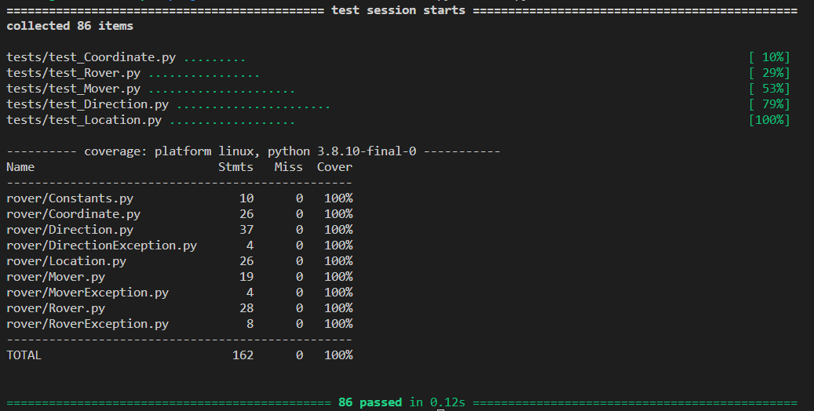

# [Mars Rover](https://katalyst.codurance.com/simple-mars-rover)
Redeveloped after Chapter 9, using test driven design. No app has been created, only the rover functionality
implemented as classes and unit tested.

## Result
Running "python3 -m pytest" in my environment produces the following:
