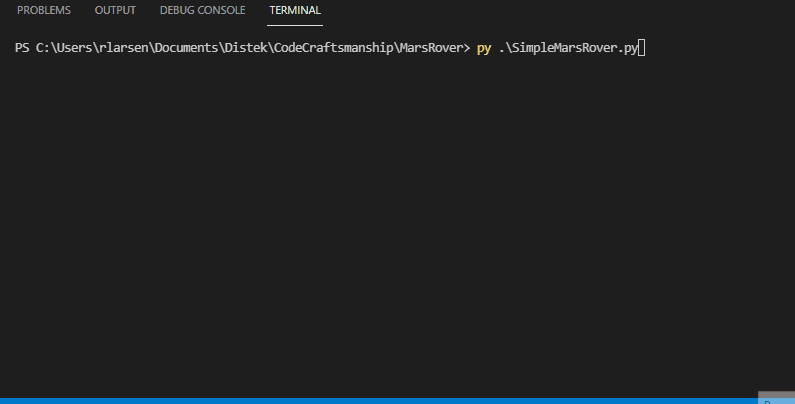

# Clean Code Practice
A place for practicing clean code principles from Robert C. Martin's "Clean Code", as well as learning and practicing python.

Utilizing code kata's for practice. The demos for my katas are shown below.

## FizzBuzz

## Mars Rover
Developed with chapter 2 of Clean Code in consideration, regarding naming. I also explored principles of small functions that do one thing, which is discussed later in the book.

