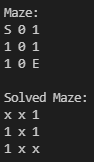
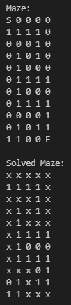
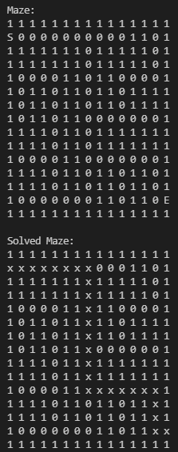

# [Tiny Maze](https://github.com/joebobfisher/software-craftsmanship-club/blob/main/tiny-maze/README.md)
Developed with chapter 5 of Clean Code in consideration, regarding formatting.

## Simple Test

## Test Two, Larger Maze

## Test Three, Randomly Generated Maze
